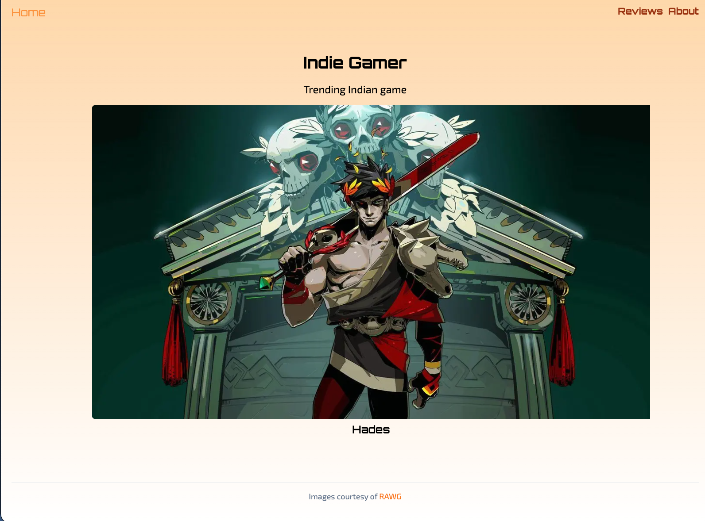
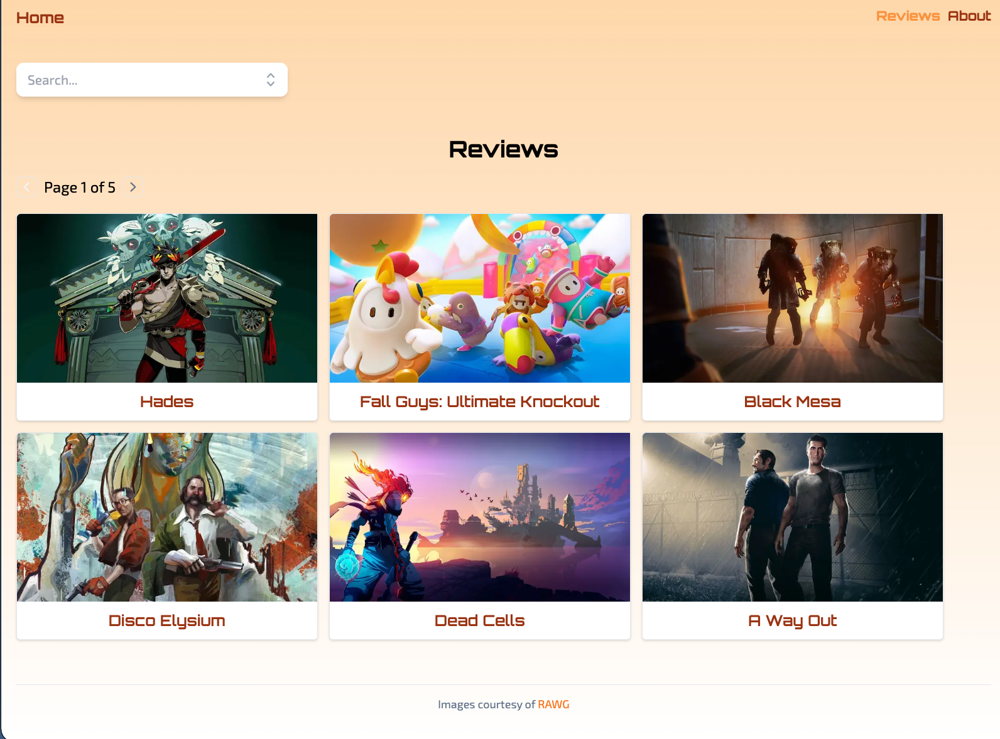
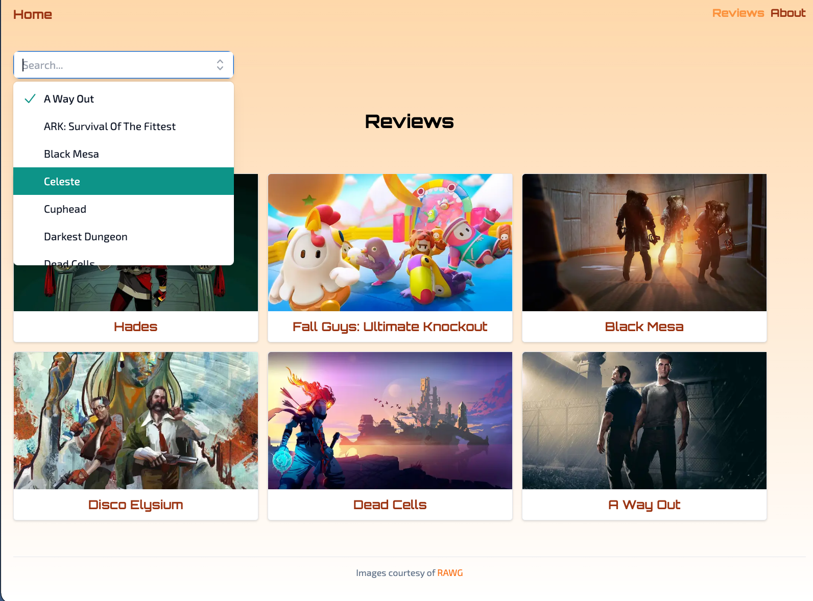
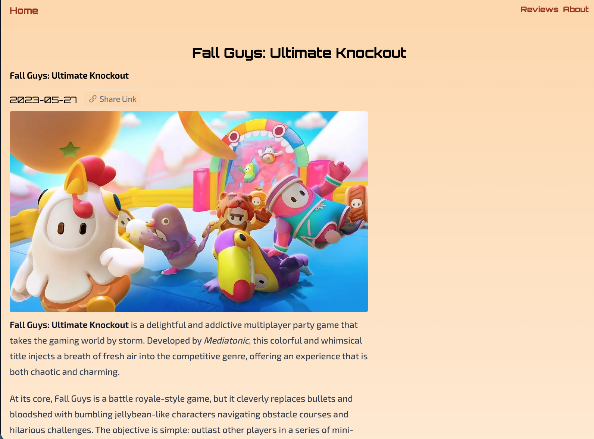
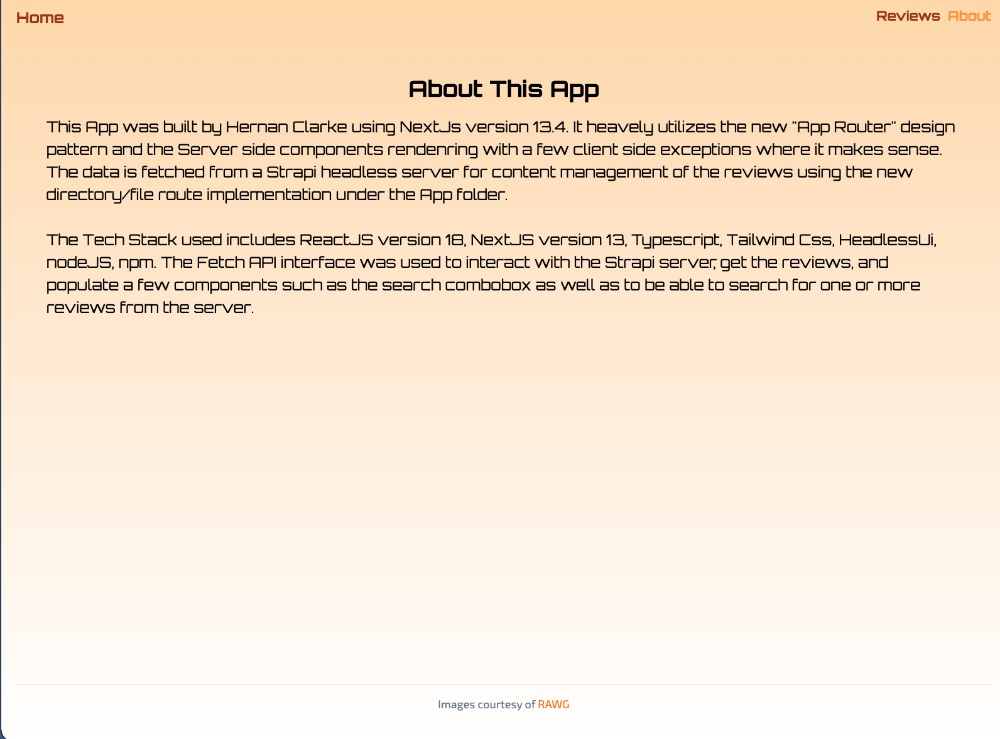

This app is a fullstack application build using Nextjs version 13.4 to access the gaming reviews of an epic indie game review system hosted on the Content Management System, "Strapi", to test the new features of Nextjs (Version 13.4).

Overall, I found the new NextJs version 13 to be quite impresive!  

The ability to leverage server side rendering while still being able to use useEffect hooks on the client side to selectibly load data into components gives the best of both worlds.  IN short, it is a game-changer for data handling as we can now combine server and client components, employing server components for quickly loaded, non-interactive portions of your application while relying on client components for interactivity, browser APIs & more.

App/Directory for File-Based Routing:

File-based routing is one of Next.js 13 best features. Routes can be specified using the directory project structure instead of dealing with complicated route settings in a program like react-router. You can construct a new path by adding an entry point to the directory page.

Async Components & Data Fetching:

Async components, a new method of data collecting for server-rendered components, allow us to render systems using Promises with async & await when utilizing async components.

If a Promise-returning external service or API needs to be queried for data, we can declare the component as async and wait for the outcome.

New Image COmponent:

Less client-side JavaScript, styling and configuration, and increased accessibility are all features of the new Image component in Next.js. The next/image import has been changed to next/legacy/image, and the next/future/image import has been renamed to next/image in terms of code modifications. There is a codemod to facilitate rapid migration.

2. @next/font:

The new @next/font allows you to use Google Fonts (or any custom font) without the browser sending any queries. CSS and font files are downloaded at build time with other static assets.

For Tech Stack, I sued Typescript and NextJS version 13.4. For styling, I used tailwindcss and headlessui with the fonts Orbitron and  Exo_2.

Bellow find a series of screenshuts of the final application:

Home Page:

Reviews Page:

Search Component:

Slug Review Page:

About Page:

